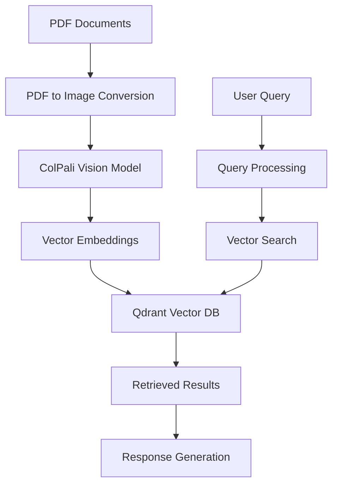

# Multimodal RAG Pipeline using ColPali

A robust, production-ready RAG (Retrieval-Augmented Generation) pipeline that uses Vision Language Models to process and query multimodal documents through OpenWebUI.

## 🌟 Features

- **Vision-Language Document Processing**: Uses ColPali models to understand both text and visual elements in documents
- **PDF to Image Conversion**: Automatically converts PDF documents to high-quality images for processing
- **Vector Database Storage**: Efficient storage and retrieval using Qdrant with optimized configurations
- **OpenWebUI Integration**: Seamless integration as a pipeline with OpenWebUI
- **Background Initialization**: Non-blocking startup process for better user experience
- **State Persistence**: Intelligent state management to avoid redundant initialization
- **Multi-threaded Processing**: Optimized for performance with concurrent processing

## 🏗️ Architecture



## 📋 Requirements

### System Dependencies
- **Python 3.11+**
- **CUDA-capable GPU** (recommended)
- **Poppler**: Required for PDF processing
  - Windows: Download from [Poppler for Windows](https://blog.alivate.com.au/poppler-windows/)
  - Linux: `sudo apt-get install poppler-utils`
  - macOS: `brew install poppler`

### Python Dependencies
```
pdf2image>=3.1.0
qdrant-client>=1.7.0
colpali-engine>=0.2.0
Pillow>=10.0.0
torch>=2.0.0
transformers>=4.35.0
requests>=2.31.0
```

## 🚀 Installation

### 1. Install System Dependencies

#### Windows
1. Download Poppler for Windows
2. Extract to a folder (e.g., `C:\poppler-23.11.0`)
3. Add the `bin` directory to your system PATH:
   - `C:\poppler-23.11.0\Library\bin`
4. Restart your terminal/IDE

#### Linux
```bash
sudo apt-get update
sudo apt-get install poppler-utils
```

#### macOS
```bash
brew install poppler
```

### 2. Install Python Dependencies
```bash
pip install pdf2image qdrant-client colpali-engine Pillow torch transformers requests
```

### 3. Configure OpenWebUI Integration
1. Copy the pipeline file to your OpenWebUI pipelines directory
2. Update the configuration variables in the pipeline:
   ```python
   BASE_URL = "http://your-openwebui-host:port/api/v1"
   API_KEY = "your-api-key"  # Optional
   ```
3. Restart OpenWebUI

## ⚙️ Configuration

### Pipeline Configuration
Update these variables in the pipeline file:

```python
# OpenWebUI API Configuration
BASE_URL = "http://10.1.42.88:8080/api/v1"
API_KEY = "sk-5d9ab3bd43c846f2a6da49e68dacbbf5"  # Optional

# Model Configuration
model_name = "vidore/colqwen2-v1.0"  # or "vidore/colqwen2.5-v0.1"

# Processing Configuration
downloads_dir = "downloads"  # Directory for downloaded files
dpi = 200  # Image conversion quality
```

### Qdrant Configuration
The pipeline automatically configures Qdrant with optimized settings:
- **Storage**: On-disk payload storage for large datasets
- **Quantization**: INT8 scalar quantization for memory efficiency
- **Multi-vector**: MAX_SIM comparator for optimal retrieval
- **Distance**: Cosine similarity for semantic matching

## 📖 Usage

### 1. Document Ingestion
Documents are automatically ingested from OpenWebUI's knowledge base:
1. Upload PDF documents to OpenWebUI knowledge collections
2. The pipeline will automatically process them during initialization
3. Documents are converted to images and embedded using ColPali models

### 2. Querying
Simply ask questions through OpenWebUI chat interface:
```
"What does the financial report say about Q3 revenue?"
"Show me the architectural diagram from the technical documentation"
"Find information about the company's sustainability initiatives"
```

### 3. Advanced Usage

#### Manual Initialization Reset
If you need to force re-initialization:
```python
pipeline = Pipeline()
pipeline.reset_initialization()
```

#### Custom Query Parameters
```python
results = pipeline.query(
    question="Your question here",
    top_k=10  # Number of results to return
)
```

## 🔧 Troubleshooting

### Common Issues

#### 1. Poppler Not Found
```
Error: Poppler's 'pdftotext.exe' was not found in the PATH
```
**Solution**: Ensure Poppler is installed and added to your system PATH.

#### 2. CUDA Out of Memory
```
Error: CUDA out of memory
```
**Solutions**:
- Reduce batch size in processing
- Use CPU processing: change `device_map="cpu"`
- Process fewer documents at once

#### 3. API Connection Issues
```
Error: Request error: Connection refused
```
**Solution**: Verify OpenWebUI is running and the BASE_URL is correct.

#### 4. Model Loading Issues
```
Error: Cannot load colpali models
```
**Solutions**:
- Check internet connection for model download
- Verify CUDA installation if using GPU
- Try CPU mode if GPU issues persist

### Debug Mode
Enable detailed logging by modifying the pipeline:
```python
import logging
logging.basicConfig(level=logging.DEBUG)
```

## 🚦 Pipeline States

The pipeline manages several states:

- **`__init__`**: Basic setup and dependency checks
- **`on_startup`**: Lightweight initialization, schedules background work
- **Background Init**: Heavy model loading and document processing
- **Ready**: Fully initialized and ready for queries

State is persisted in `pipeline_state.json` to avoid redundant initialization.

## 🔒 Security Considerations

- **API Keys**: Store API keys securely, consider environment variables
- **File Access**: Pipeline only accesses files through OpenWebUI API
- **Network**: Ensure secure connections to OpenWebUI instance
- **Model Downloads**: Models are downloaded from Hugging Face Hub

## 📊 Performance Optimization

### GPU Memory Management
- **Model Precision**: Uses bfloat16 for memory efficiency
- **Flash Attention**: Automatic detection and usage when available
- **Quantization**: INT8 quantization reduces memory footprint

### Processing Optimization
- **Multi-threading**: PDF conversion uses half of available CPU cores
- **Batch Processing**: Processes multiple images efficiently
- **Caching**: Reuses initialized models and database connections

### Storage Optimization
- **On-disk Payload**: Large metadata stored on disk
- **Vector Compression**: Quantized vectors for reduced storage
- **Incremental Updates**: Only processes new or changed documents

## 📈 Scaling Considerations

### Horizontal Scaling
- **Multiple Instances**: Can run multiple pipeline instances
- **Load Balancing**: Distribute queries across instances
- **Shared Storage**: Use external Qdrant instance for shared vector storage

### Vertical Scaling
- **GPU Scaling**: Supports multi-GPU setups
- **Memory Scaling**: Configurable batch sizes and caching
- **Storage Scaling**: Qdrant supports distributed deployments

## 🤝 Contributing

1. Fork the repository
2. Create a feature branch: `git checkout -b feature/amazing-feature`
3. Commit changes: `git commit -m 'Add amazing feature'`
4. Push to branch: `git push origin feature/amazing-feature`
5. Open a Pull Request

### Development Setup
```bash
git clone https://github.com/yourusername/colpali-rag-pipeline.git
cd colpali-rag-pipeline
pip install -r requirements.txt
```

## 📄 License

This project is licensed under the MIT License - see the [LICENSE](LICENSE) file for details.

## 🙏 Acknowledgments

- **ColPali Team**: For the excellent vision-language models
- **Qdrant**: For the high-performance vector database
- **OpenWebUI**: For the intuitive chat interface
- **Hugging Face**: For model hosting and transformers library

## 📞 Support

- **Issues**: [GitHub Issues](https://github.com/sancelot/open-webui-multimodal-pipeline/issues)
- **Discussions**: [GitHub Discussions]([https://github.com/yourusername/colpali-rag-pipeline](https://github.com/sancelot/open-webui-multimodal-pipeline)/discussions)

## 🔄 Changelog

### v4.0 (2025-03-07)
- ✨ Added background initialization for faster startup
- 🔧 Improved error handling and state management
- 📈 Performance optimizations for large document sets
- 🐛 Fixed OpenWebUI integration issues

### v3.0
- 🎯 Multi-vector support for better retrieval
- 🗜️ Vector quantization for memory efficiency
- 🔄 Automatic document synchronization

### v2.0
- 🖼️ PDF to image conversion pipeline
- 💾 Persistent state management
- 🚀 OpenWebUI integration

### v1.0
- 🎉 Initial release with basic RAG functionality

---

**Made with ❤️ for the AI community**
